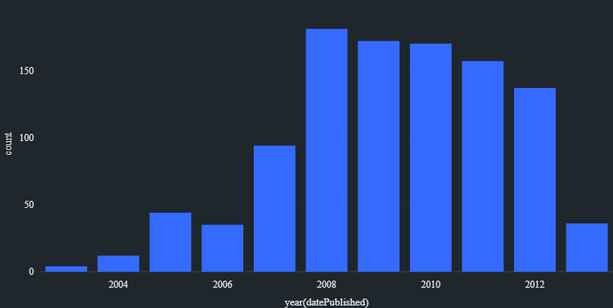

# HelloFresh Data Engineering Test ETL Readme

## Aproach

Read new recipe data from input folder. Used spark structure streaming to handle and process new data to target parquet table. Used foreachbatch processing to write data to parquet tables and corrupted data will be stored separately while validated data stored to a separate location for further use

Used the validate data from previouse step to filter out recipes with `Beef` as an ingredient and added new column with difficulty level. Then using dificulty level calculate average total cooking time for each difficulty level

Aggregated output later saved to the output directory as a CSV under the name `avg_total_cooking_time.csv` which contains `difficulty, avg_total_cooking_time` columns.

## Data Exploration

`29.17%` records has total cooking time equal to 0

only `4.51%` recipes has beef as an ingredient

recipe pulication peeked during 2008 and follwed by a down trend afterward

Average preparation time (`28.8 minutes`) is greater than the average cooking time (`22.4 minutes`) when considering all the recipies available

## Assumptions

parquet table partitioned based on the execution date

assumed `totalCookingTime == 0` as a bad data for aggregation due to impracticality of the real life task hence excluded from the aggregation

pre processing is a streaming job to handle new json files coming in to input folder

csv file generation is a batch process to provide proper aggregations with new data processed with from the previous step

## Instructions

### Run Locally Using Docker Container

#### Pull Docker Image From GitHub Repository

run command prompt as admin
paste `docker login ghcr.io --username <your-githum-username>`
on the prompt copy paste your personal access token

use `docker pull <image-name>` to pull image from the git repository

#### Create Docker Image Using Repository

run this command on prompt  to create a docker image `docker build -t hellofresh_sanojfonseka .`

#### Run Application On Docker Container

run this command to deploy the application on a docker container `docker run hellofresh_sanojfonseka:latest`

or run this command to deploy the application on a docker container `docker run <repository-iamge-name>`

#### spark-submit on a cluster

<pre>/opt/spark/bin/spark-submit \
--master <master-node> \
--deploy-mode cluster \
--name etl \
--conf spark.driver.memory=4G \ 
--conf spark.executor.memory=4G \
--conf spark.driver.maxResultSize=4G \
--conf spark.scheduler.mode=FAIR \ 
--conf spark.serializer.objectStreamReset=100 \ 
--conf spark.shuffle.manager=SORT \
--conf spark.shuffle.memoryFraction=0.2 \
--conf spark.shuffle.reduceLocality.enabled=false \
--conf spark.shuffle.service.port=4048 \
--conf spark.speculation=false \
--conf spark.speculation.multiplier=3 \
--conf spark.speculation.quantile=0.9 \
--conf spark.dynamicAllocation.shuffleTracking.enabled=true \
--conf spark.dynamicAllocation.enabled=true \
--conf spark.dynamicAllocation.minExecutors=1 \
--conf spark.dynamicAllocation.maxExecutors=4 \ 
--conf spark.dynamicAllocation.initialExecutors=1 \
--conf spark.executor.userClassPathFirst=true \
--conf spark.sql.parquet.int96RebaseModeInWrite=LEGACY \
--conf spark.ui.enabled=False \
local:///app/task_run.py</pre>

## Bonus points need to address

- How would you implement CI/CD for this application?
1. Developer push changes to the feature branch of the repository
2. Run unit tests, sonarqube with quality gates on the repository push
3. Reviewer approvals and merge to developer branch
4. Build and push docker image and deployment on developer environment
5. Commit push and deploy to QA environment for automated QA tests
6. On test pass deploy to staging and production environments

- How would you diagnose and tune the application in case of performance problems?
1. Tune number of `spark.sql.shuffle.partition` to make sure 3 tasks per executor and 100mb a partition. And increase/decrease resources accordingly to utilize resorces optimally and have optimal parallalism
2. Use dataframe persist to reduce recomputation due to spark's lazy evaluation
3. Address data skewness based on driver logs
4. Tune `spark.driver.memory` and adjust heap memory allocations
5. Tune number of executors and cores on the cluster

- How would you schedule this pipeline to run periodically
1. Based on azure cloud platform we can use azure functions to trigger the application based on time intervals / database changes
2. Streaming query already adjusted to run periodically with `trigger(once=True)` to process all the avaialable new data during a trigger